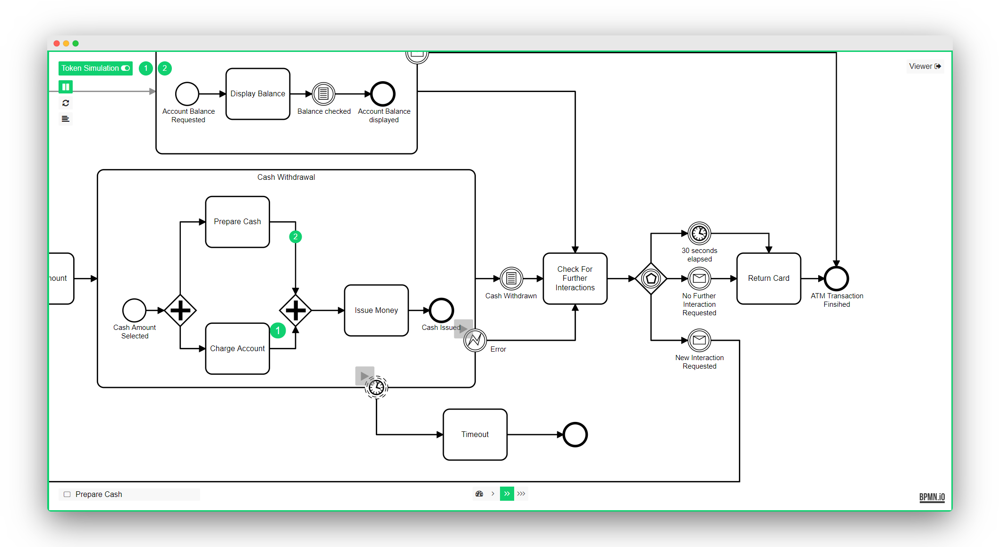

# 汉化版 bpmn-js Token Simulation (bpnm模拟流转流程)

[](https://travis-ci.com/bpmn-io/bpmn-js-token-simulation)

一个npnm 模拟流转流程的模拟器,基于bnpm使用,只是简单的汉化



## Installation

Install via [npm](http://npmjs.com/).

```
npm install tl-hh-bpmn-js-token-simulation
```

Add as additional module to [bpmn-js](https://github.com/bpmn-io/bpmn-js).

### Modeler

```javascript
var BpmnModeler = require('bpmn-js/lib/Modeler');
import tokenSimulation from 'tl-hh-bpmn-js-simulation';

var modeler = new BpmnModeler({
  container: '#canvas',
  additionalModules: [
    tokenSimulation
  ]
});
//当前css 也需要引入
@import "tl-hh-bpmn-js-simulation/assets/css/bpmn-js-token-simulation.css";
@import "tl-hh-bpmn-js-simulation/assets/css/font-awesome.min.css";
@import "tl-hh-bpmn-js-simulation/assets/css/normalize.css";
```

### Viewer

```javascript
var BpmnViewer = require('bpmn-js/lib/NavigatedViewer');
var tokenSimulation = require('bpmn-js-token-simulation/lib/viewer');

var viewer = new BpmnViewer({
  container: '#canvas',
  additionalModules: [
    tokenSimulation
  ]
});
```

## Example

Install dependencies.

```bash
npm install
```

Run example.

```bash
npm start
```

Check out `localhost:8080`.

## Supported Elements

* Boundary Event (attached to Subprocess)
* Call Activity
* End Event
* Event-based Gateway
* Exclusive Gateway
* Intermediate Catch Event
* Intermediate Throw Event
* Parallel Gateway
* Start Event
* Task
* Terminate End Event
* Subprocess

以上事件没有详细说明,感谢原插件的开发者,原插件链接:https://github.com/bpmn-io/bpmn-js-token-simulation

## Licence

MIT
